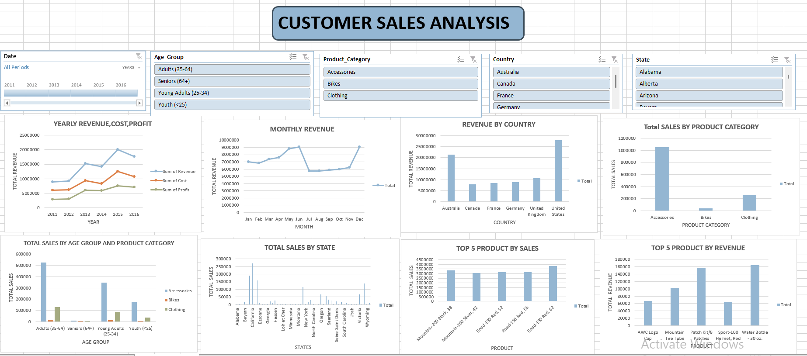

# Customer Sales Analysis  

This project provides an interactive **Excel dashboard** for analyzing customer sales performance across multiple dimensions. The dashboard is designed to give quick insights into revenue, profit, and customer behavior.  

## Key Insights  

- **Yearly Trends:** Visualizes revenue, cost, and profit growth from 2011 to 2016.  
- **Monthly Revenue:** Tracks seasonal patterns and peak months in sales.  
- **Geographical Insights:**  
  - Revenue comparison by **Country** (United States leads, followed by Australia).  
  - Total sales breakdown by **State**.  
- **Product Analysis:**  
  - Sales performance by **Product Category** (Accessories, Bikes, Clothing).  
  - **Top 5 Products by Sales** and **Top 5 Products by Revenue**.  
- **Customer Demographics:** Shows sales distribution across different **Age Groups** and product categories.  

## Features  

- Interactive **slicers** for filtering by Year, Age Group, Product Category, Country, and State.  
- Clear visualization of **KPIs** (Revenue, Cost, Profit, Sales).  
- Easy-to-use interface for identifying patterns, trends, and top-performing segments.  

## Dashboard Preview  

  
